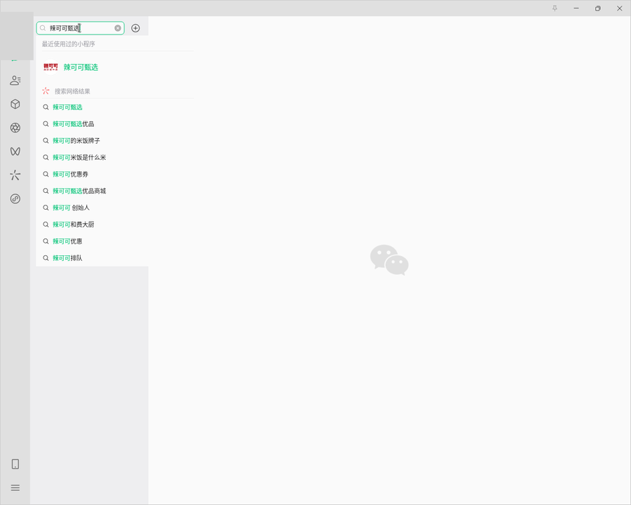

# 部署方案：青龙面板

适合已经在用青龙面板的人：把每日签到挂进去，用它现成的定时任务、环境变量管理、任务日志和通知，
不必自己写 cron、也不必另做一套通知配置。

**前提**：青龙与微信实例必须跑在**同一台宿主机**上（青龙要调用宿主 docker 去操作微信容器）。
本文从零写到能跑，照着做完即可。

**资源**：微信实例 1.2 GiB（跑起小程序 1.8 GiB）+ hook 0.47 GiB + 云微面板 0.12 GiB + 青龙约 0.2 GiB，
合计约 **2.5 GiB 内存**、约 **6 GB 磁盘**；建议 **2 核 4 GiB** 起步。

---

## 第一部分：把微信容器跑起来

### 1. 装 Docker

```bash
curl -fsSL https://get.docker.com | sh
sudo usermod -aG docker $USER && newgrp docker
```

### 2. 部署微信实例（云微 WechatOnCloud）

云微是三个容器方案里唯一内置完整设备伪装的项目（对比见 [CONTAINER-OPTIONS.md](CONTAINER-OPTIONS.md)）。

```bash
mkdir -p ~/woc && cd ~/woc
curl -fsSLO https://raw.githubusercontent.com/Gloridust/WechatOnCloud/main/docker-compose.yml
```

编辑 `docker-compose.yml`：**删掉 `- /dev:/host-dev:ro`**（无摄像头时不需要，部分环境挂载会失败）。

先生成面板登录密码，**把打印出来的这串记下来**（后面登录面板要用）：

```bash
PW="woc-$(head -c 12 /dev/urandom | base64 | tr -dc 'A-Za-z0-9' | head -c 10)"
echo "面板密码: $PW"
```

建 `.env`（第一行填 `$PW` 的值）：

```dotenv
WOC_PASSWORD=<上一步打印出来的密码>
WOC_HTTP_PORT=36080
WOC_SPOOF_OS=1
# 默认软阈值 1500MiB 太低（跑起小程序实测到 1.8G），看门狗会「柔和重启」实例，
# 而重启 = 微信掉登录（要手机确认）+ hook 容器被连坐带走
WOC_INSTANCE_MEM_SOFT_MB=2800
WOC_INSTANCE_MEM_HARD_MB=4000
```

```bash
docker compose up -d
```

> **坑**：`docker compose` 若报 WSL 相关错误（Windows 上会遇到），改用等价的 `docker run`，
> 并**必须给面板和实例指定同一个自定义网络**——默认 bridge 没有容器名 DNS，而面板按容器名反代实例，
> 结果就是进实例时一直「桌面长时间未就绪」：
> ```bash
> docker network create woc-net
> docker run -d --name woc-panel --network woc-net -p 36080:8080 \
>   -v ~/woc/data-panel:/data -v /var/run/docker.sock:/var/run/docker.sock \
>   -e PORT=8080 -e WOC_DOCKER_NETWORK=woc-net \
>   -e WOC_WECHAT_IMAGE=docker.io/gloridust/wechat-on-cloud:1.4.9 \
>   -e PANEL_ADMIN_USER=admin -e PANEL_ADMIN_PASSWORD=<同一个密码> \
>   -e WOC_SPOOF_OS=1 -e WOC_INSTANCE_MEM_SOFT_MB=2800 -e WOC_INSTANCE_MEM_HARD_MB=4000 \
>   -e TZ=Asia/Shanghai --restart unless-stopped gloridust/woc-panel:latest
> ```

### 登录面板

浏览器打开 `http://<机器IP>:36080`，用户名 `admin`、密码是上面生成的那串 → 新建「微信实例」→
等镜像拉完、微信自动装好 → 进实例 → 手机扫码登录。

**密码存在哪、忘了怎么找回**：

| 情况 | 做法 |
|---|---|
| 正常情况 | 就在部署目录的 `.env` 里：`grep WOC_PASSWORD ~/woc/.env` |
| `.env` 没了 | 从运行中的面板容器读：<br>`docker inspect woc-panel --format '{{range .Config.Env}}{{println .}}{{end}}' \| grep PANEL_ADMIN` |
| 当时没设 | 官方 compose 的默认值是 `WOC_PASSWORD=wechat`（用户名 `admin`）。**不要用默认值**——这个面板能操作宿主机 Docker |
| 想换密码 | 改 `~/woc/.env` 的 `WOC_PASSWORD` 后重建面板；微信实例在数据卷里，不受影响 |

> 注意本方案有两个 `.env`，别搞混：**`~/woc/.env` 是云微面板的**（面板密码、内存阈值），
> **`lakeke.env` 是签到脚本的**（身份、token、通知）。青龙环境变量页里配的是后者。

校验设备伪装（应看到唯一 machine-id、像个人电脑的 hostname、`/.dockerenv` 已移除、真实 OUI 的 MAC）：

```bash
docker exec <实例容器名> sh -c 'cat /etc/machine-id; hostname; \
  [ -e /.dockerenv ] && echo "dockerenv 还在(未伪装)" || echo "dockerenv 已移除 ✓"; \
  cat /sys/class/net/eth0/address; grep PRETTY_NAME /etc/os-release'
```

### 3. 打开小程序（首次人工一次，之后由脚本自动）

微信窗口里搜 **辣可可甄选** → 打开 → 点首页横幅左下角 **「点击签到」**
→ 弹「即将打开 辣可可现炒黄牛肉」→ 允许 → 落到辣可可签到页。

| 微信里搜索入口 | 首页横幅与跳转确认 |
|---|---|
|  |  |

必须打开过：`wx.login` 的 jsCode 与 appid 绑定，只有辣可可那个小程序在运行，才能换到它的 token。
之后被关掉也没关系，`reopen_miniapp.py` 会自动重开（保活任务会调它）。

### 4. 把脚本放到青龙的脚本目录

先定好一个宿主机目录作为「脚本目录」，后面青龙和 hook 容器都指到它：

```bash
SCRIPTS=/root/ql/data/scripts        # 与青龙的数据卷同盘，方便它读取
mkdir -p $SCRIPTS
git clone --depth 1 https://github.com/LeapYa/lakeke-sign.git /tmp/ls
cp -r /tmp/ls/lakeke-sign $SCRIPTS/  # 保持 lakeke-sign/ 这一层
```

### 5. 挂 hook 容器（旁挂，不动云微的实例）

云微建的实例没有 `CAP_SYS_PTRACE`，frida attach 不了，所以旁挂一个共享命名空间的 helper：

```bash
WX=<实例容器名>                      # 例 woc-wx-2ada0225ca
VOL=woc-data-${WX#woc-wx-}           # 云微的数据卷名

docker run -d --name woc-hook \
  --pid=container:$WX \
  --network=container:$WX \
  --cap-add=SYS_PTRACE --security-opt seccomp=unconfined \
  -v $SCRIPTS:/work \
  -v $VOL:/config:ro \
  node:22-slim sleep infinity
```

> `-v $SCRIPTS:/work` 必须指向**上面那份脚本目录**。取参脚本会把 `lakeke.env` 写到
> `/work/lakeke-sign/`，青龙执行任务时读的是同一个文件，两边路径不一致就会出现
> 「`lakeke.env` 一直不更新」。
>
> 两个 `--pid` / `--network` **都必须是 `container:`**。只共享 PID 不共享网络的话，
> 小程序连不上 `ws://localhost:9421`（那是实例自己 netns 里的地址），hook 日志不会出现 `[miniapp] connected`。

装 WMPFDebugger 与 Linux 版 frida：

```bash
git clone --depth 1 https://github.com/evi0s/WMPFDebugger.git /tmp/wmpfd
docker exec woc-hook sh -c '
  mkdir -p /opt/wmpf && cd /tmp/wmpfd 2>/dev/null
  cp -r /tmp/wmpfd/src /tmp/wmpfd/package.json /tmp/wmpfd/tsconfig.json /tmp/wmpfd/frida /opt/wmpf/
  cd /opt/wmpf
  npm i --ignore-scripts --registry=https://registry.npmmirror.com --no-audit --no-fund
  mkdir -p node_modules/frida/build
  curl -fsSL -o /tmp/f.tar.gz https://github.com/frida/frida/releases/download/17.18.0/frida-v17.18.0-napi-v8-linux-x64.tar.gz
  tar -xzf /tmp/f.tar.gz -C node_modules/frida/build --strip-components=1
  node -e "console.log(require(\"frida\").version)"
'
```

> `npm i --ignore-scripts` 会跳过 frida 的 install 脚本，JS 包装层不会被生成。
> 需要从一份在 Windows 上正常装过的 clone 里，把 `node_modules/frida/build/src` 拷过来补上
> （Linux 的 `.node` 用上面下载的那份）。
>
> **WMPF 版本必须落在 `frida/config/linux/` 的配置里**（当前 14910 / 14978 / 25665）。
> 微信 Linux 4.1.13 实测是 **25665**。

```bash
docker commit woc-hook woc-hook:1     # 固化，之后重建不必重装
docker exec -d woc-hook sh -c 'cd /opt/wmpf && node node_modules/ts-node/dist/bin.js src/index.ts > /tmp/wmpf.log 2>&1'
docker exec woc-hook tail -5 /tmp/wmpf.log   # 期望：[frida] script loaded, WMPF version: 25665
```

### 6. 抓身份写入 lakeke.env

```bash
docker exec woc-hook sh -c 'cd /work/lakeke-sign && \
  NODE_PATH=/opt/wmpf/node_modules node cdp_lakeke_ident.js 60'
cat $SCRIPTS/lakeke-sign/lakeke.env      # 脱敏看字段是否齐全
```

它会按 `appId=wxf8a17a14c0521576` + `mpId=gh_6420f1a617e8` 双重校验挑上下文，写入整组身份。

> 别跨账号复用同一个 `lakeke.env`：token 换成 B 账号、openId 还是 A 的，接口会返 `208 授权码错误`。
> 判断方法：JWT 的 `sub` 就是该账号在辣可可下的 openId，与 env 里的 openId 一比就知道串没串。

---

## 第二部分：用青龙来调度

### 7. 装青龙

```bash
mkdir -p ~/ql && cd ~/ql

docker run -d --name qinglong \
  -p 5700:5700 \
  -v ~/ql/data:/ql/data \
  -v /var/run/docker.sock:/var/run/docker.sock \
  -v $(which docker):/usr/bin/docker \
  --restart unless-stopped \
  whyour/qinglong:latest
```

访问 `http://<机器IP>:5700` 完成初始化。

> **两处挂载不能省**：`daily.sh` 靠 `docker exec` / `docker cp` 操作微信实例与 hook 容器，
> 青龙必须拿到宿主 docker。`$(which docker)` 是宿主 docker 二进制，也可以进容器
> `apt-get install -y docker.io` 装一个客户端。
>
> 青龙的数据卷要包含上面那个 `$SCRIPTS` 目录（本文用 `~/ql/data/scripts`），
> 这样青龙读到的脚本和 hook 的 `/work` 是同一份。

### 8. 青龙里配环境变量

「环境变量」页添加，任务运行时自动注入：

```
LAKEKE_PYTHON=/usr/bin/python3
WOC_INSTANCE=woc-wx-2ada0225ca
WOC_HOOK=woc-hook
LAKEKE_NOTIFY_ALWAYS=1
WECOM_WEBHOOK=https://qyapi.weixin.qq.com/cgi-bin/webhook/send?key=xxxx
```

> 青龙的环境变量是**全局注入**的。`WOC_INSTANCE` 这类名字很少冲突，但 `SMTP_*`、`PUSHPLUS_TOKEN`
> 若你别的任务也用到，会一起被注入，按需取舍。

### 9. 定时任务

| 名称 | 命令 | 定时规则 |
|---|---|---|
| 辣可可签到 | `bash /ql/data/scripts/lakeke-sign/daily.sh` | `5 8 * * *` |
| 辣可可保活 | `bash /ql/data/scripts/lakeke-sign/daily.sh --ensure-only` | `0 */2 * * *` |

保活任务只做自检与「小程序在线/重开」，不签到，可以随便高频跑。跑得勤，早上那次基本不会遇到
小程序被关的情况。两条都先「运行一次」验证，再看任务日志。

### 10. 依赖

**不需要 pip 装任何东西。** `lakeke_run.py`、`member_info.py`、`notify.py` 只用 Python 标准库；
JS 侧（`cdp_*.js`）跑在 woc-hook 里，用那边装好的 node 与 frida。青龙镜像自带 python3。

### 11. 通知

两条路：

1. **用项目自带的 `notify.py`（推荐）**：渠道多（企业微信 / PushPlus / WXPusher / 钉钉 / 邮件 /
   通用 webhook），会按各渠道字节上限自动降级。在上面的环境变量里配好对应变量即可。
2. 用青龙自带的「通知设置」：把结果交给青龙推送。不过「签到成功 / 今日已签 / 失败」的判定在
   `daily.sh` 里做，青龙只是搬运。

---

## 排查

| 现象 | 原因 |
|---|---|
| 任务日志报 `docker: not found` | 青龙容器没挂 docker 二进制，或没挂 docker.sock |
| 报 `Cannot connect to the Docker daemon` | 同上，检查 `-v /var/run/docker.sock:...` |
| 「微信实例容器未运行」 | 云微实例没起，或 `WOC_INSTANCE` 名字写错 |
| 一直提示小程序不在 | 微信没登录、或没打开过辣可可甄选首页 |
| `lakeke.env` 不更新 | hook 容器的 `/work` 与青龙脚本目录不是同一份（见第 5 步的说明） |
| 实例「桌面长时间未就绪」 | 面板与实例不在同一自定义网络（见第 2 步的坑） |
| 微信突然要重新登录 | 实例被看门狗重启（内存超软阈值），调高 `WOC_INSTANCE_MEM_SOFT_MB` |
| `RESULT=208 / 211` | token 失效或身份串了 → 重跑 `cdp_lakeke_ident.js` |
| `RESULT=401` | 该账号还不是会员 → 跑 `lakeke_register.py`（配 `LAKEKE_REGISTER_PHONE`） |
| `RESULT=402` | 会员卡不可用，去小程序看卡状态 |

## 和直接 cron 的取舍

| | 青龙面板 | 直接 cron |
|---|---|---|
| 界面看日志、改定时 | 有 | 自己看文件 |
| 环境变量集中管理 | 有 | 写在 `.env` / crontab |
| 通知 | 自带，也可用 `notify.py` | 用 `notify.py` |
| 机器上多一个容器 | 是（约 200 MB 内存） | 无 |
| 额外要求 | 必须能访问宿主 docker，且与微信实例同机 | 无 |

只跑这一个签到的话，直接 cron 更省事（见 [DEPLOY-LINUX.md](DEPLOY-LINUX.md) 第六节）；
已经在用青龙、或者还要跑别的签到脚本，走青龙顺手。
