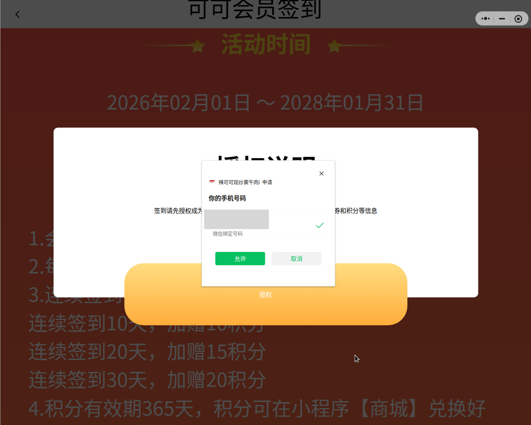

# 原理与接口

## 签到入口在哪

签到页不在辣可可主小程序里，真实路径：

```
辣可可甄选 (wxb98e6393065cf180)  首页轮播图「每日积分签到」
        ↓ 点击
辣可可 (wxf8a17a14c0521576)     pages/sign/index
        ↓
立即签到
```

直接打开辣可可进不到签到页，启动参数（`gameId` 等）由甄选跳转时带过去。

自动化不需要走这条路径：`gameId` 是长活动常量（活动期到 2028-01），`memberId/cardId/cardNo`
可用 `/api/member/single` 查。日常签到只要**辣可可小程序处于打开状态（任意页面）**即可。

## 界面流程

> **先记住一条：Linux 版和 Windows 版的微信是两套外壳，界面不通用。**
> 实测 Linux 版主程序 `/opt/wechat/wechat` 里**没有任何 Qt 依赖**（自绘 + 自研的 mm 系列模块），
> 主界面窗口的持有进程就是它；`WeChatAppEx`（Chromium 系、独立进程）负责小程序面板与小程序窗口。
> Windows 4.0 是另一套实现，入口布局也不同 —— 最明显的差别是
> **Linux 侧边栏有独立的小程序面板按钮，Windows 没有**。
> 所以下面这些界面路径与比例坐标**只对 Linux 版成立**，换端要重新找入口。
>
> **Windows 新版在往「窗口内右侧栏」收敛**（用户截图确认）：小程序入口收进
> **「发现 → 小程序」**，主窗口搜索、小程序面板里的搜索都是**同一窗口内的右侧栏**展开，
> 不再另开独立窗口。Linux 版目前仍是「独立 X 窗口」形态（侧边栏独立的「小程序面板」按钮，
> 搜索与小程序各占一个 X 窗口）。
>
> **如果 Linux 以后跟进这套布局，本项目要改两处**：
> ① **入口定位**：`reopen_miniapp.py` 现在找「侧边栏顶部那组的最后一个按钮」，
>    要改成「发现 → 小程序」两级；
> ② **结果验证**：现在靠**窗口标题精确等于小程序名**（`辣可可现炒黄牛肉i`）判断开对了没，
>    小程序若不再独立开窗，这条判据失效 —— 改用 **CDP 读 appId**
>    （枚举 `wx` 上下文能拿到 `appId=wxf8a17a14c0521576`，那才是小程序的真实身份，比标题更硬）。
>
> 反过来说，同一窗口内操作能**省掉现在最麻烦的一类坑**：面板窗口盖住主窗口吃点击、
> 主窗口/面板窗口要靠 WM_CLASS 区分、`xdotool windowclose` 把微信内部状态卡死。
> 另外入口一变，**场景号也会变**（现在的 `1183` 是「面板搜索」那条路的），
> 好在 hook 的诊断日志会直接打印真实场景号，照着补白名单即可。

下面是容器里的真实截图，按操作顺序排列。微信 Linux 版跑小程序时不做横屏适配，界面被
拉伸成整屏（功能不受影响，文档里这几张都是拉伸后的样子）。

**1. 打开入口** —— `reopen_miniapp.py` 走的路径：侧边栏顶部那组**最后一个**按钮（弹出小程序面板）
→ 面板右上角**放大镜** → 输入「辣可可现炒黄牛肉」→ **按回车** → 在结果卡片里点
**辣可可现炒黄牛肉i**。

> **注意结尾那个 `i`**：搜索会返回两个同名号 —— 不带 `i` 的（扫码点餐）是**餐饮/商城**号，
> 带 `i` 的（「为顾客提供便捷的点餐服务」）才是签到要的那个，只有它显示 `积分 / NQ=卡号`。
> 脚本按**窗口标题精确等于**判定。
> 这条路走的是商店搜索，**不依赖账号历史**（新号也能搜到，不需要先人工打开一次）。


**手动签到**的入口（自动化用不到）在**辣可可甄选**首页：点轮播图「每日积分签到」，
可点热区在横幅左下角的「点击签到」上（不是正中）。点完会弹「即将打开『辣可可现炒黄牛肉』小程序」的确认框。


**2. 签到页** —— 落到 `pages/sign/index`，中间那颗就是「立即签到」。


**3. 首次要过一次会员授权** —— 还不是会员的账号点签到会先弹授权说明，走微信手机号授权注册会员。
（给明文手机号可以直接调注册接口，跳过这一步。）



**5. 签到成功** —— 每天 +1 积分，界面会显示连续签到天数。


> 截图中的头像与手机号已打码。

## 接口

| 环节 | 地址 |
|---|---|
| 登录 | `POST wechat.wuuxiang.com/i5xforyou/auth/login`（jsCode → token，form-urlencoded） |
| 解密手机号 | `POST wechat.wuuxiang.com/i5xforyou/fans/sign/decrypt/mini/wechat/phone`（`encryptedPhoneData`+`ivPhone` → 明文） |
| 注册会员 | `POST scrm.wuuxiang.com/crm7game-api/api/member/register`（`mobile` 收明文手机号） |
| 会员信息 | `POST scrm.wuuxiang.com/crm7game-api/api/member/single`（`{gameId, gameType:2, thirdShopId}`，返回 memberId/cardId/cardNo/score） |
| 签到详情 | `POST scrm.wuuxiang.com/crm7game-api/api/game/sign/detail` |
| 执行签到 | `POST scrm.wuuxiang.com/crm7game-api/api/game/sign/signIn` |
| 签到日历 | `POST scrm.wuuxiang.com/crm7game-api/api/game/sign/monthDetail` |

业务接口统一包一层 `{mpId, openId, unionId, data:{...}}`，鉴权走 `Authorization` 头 +
`crm7-mpId` 头（分片键 `csl-GC-Shardingkey` 可选）。

`signIn` 的 data 照小程序源码：

```
{ gameId, memberId, cardId, cardNo, from, thirdShopId }
```

## 响应码（实测）

| code | 含义 |
|---|---|
| `200` | 成功 |
| `415` | 今日已签到 |
| `208` | 授权码错误（token 失效或身份不匹配） |
| `211` | 授权码失效，请刷新重试 |
| `401` | 该账号还不是会员 |
| `402` | 会员卡不可用 |
| `105` | 缺少参数 / memberId 与 openId 不一致 |

## 两件容易踩的事

**两个租户**：甄选与辣可可同属 wuuxiang SaaS，mpId 不同（辣可可 `gh_6420f1a617e8`，
甄选 `gh_08623aa177ad`）。jsCode 由哪个小程序产生，就得配哪个的 mpId 去换 token，配错报
`invalid code`。脚本按 `wx.getAccountInfoSync().miniProgram.appId` 挑上下文。

**token 短效**：JWT，实测 110 分钟有效，服务端校验 `exp`（同一 token 02:45 返 `200`、
13:12 返 `208`）。所以没有任何「抓一次长期用」的做法，只能现取现用。jsonCode 只能由微信客户端
产生，也就不存在纯服务端方案。

## 参数怎么取

WMPF 25715+ 上 `Network` 域不转发事件（`Network.enable` 有回复，但收不到 `requestWillBeSent`），
所以不走抓包，改用 CDP 的 `Runtime` 域在逻辑层直接读：

1. 扫所有 execution context，挑出 `typeof wx === 'object'` 的（AppService）
2. `wx.getStorageSync` 取 token / openId / unionId / mpId / gcId
3. `getCurrentPages()` 读页面 data 取 gameId / memberId / cardId / cardNo
4. 按 `appId` + `mpId` 双重校验确定是辣可可（多个小程序同时开着时只按 appId 会误判）

两个坑：

- **context id 每次连接都重新编号**，枚举和取参必须在同一条连接里完成
- 多个小程序同时运行时，hook 代理会把一次 `Runtime.evaluate` 的结果**回两遍**（两个小程序
  都连着 debug server），脚本取第一份即可

## 为什么必须打开「辣可可」这个小程序

`wx.login()` 在**任何**小程序里都能调，但产出的 jsCode **与 appid 绑死**：哪个小程序调用的，就只能换那个小程序的会话。
实测（`probe_code_binding.js`，收到 3 个不同 code 交叉验证）：

| code 来源 | 配辣可可 mpId | 配甄选 mpId |
|---|---|---|
| 辣可可的 code | ✅ success | ❌ invalid code |
| 甄选的 code ×2 | ❌ invalid code | ✅ success |

所以想拿辣可可的 token，必须让**辣可可那个 appid 的小程序**处于打开状态。这也是历史 bug
`invalid code` 的成因：code 取自甄选上下文、却用辣可可的 mpId 去换。

### 判据分两层（别混在一起）

| | 依赖什么 | 微信改版时 |
|---|---|---|
| **入口定位**（点哪个按钮、在哪输入、点哪张卡） | 具体界面布局 | **要跟着改**，见上面「界面流程」 |
| **身份确认**（现在开的是不是辣可可） | **appId**（`wx.getAccountInfoSync().miniProgram.appId`） | **不用改** —— 与窗口形态无关 |

所以自动化里的「打开成功」判据，最终一律落到 appId：

```bash
# 当前打开的小程序是谁（打印 APPID=wxf8a17a14c0521576；没开小程序则 APPID= 为空）
docker exec woc-hook sh -c 'cd /work/lakeke-sign && NODE_PATH=/opt/wmpf/node_modules \
  node cdp_eval.js --probe'
# 命中期望 appId 时退出码 0，否则 2 —— 可以直接 if 判断
```

`daily.sh` 就是这么做的（先 `--probe`，不在才重开，重开后再 `--probe` 复核）。
`reopen_miniapp.py` 的窗口标题判据只是**点完后的即时确认**，所以它带 `--loose`：
点了候选但没能用标题确认时返回 4（而不是 3），把最终判断权交给 appId ——
这样将来小程序不再独立开窗（Windows 新版已经是窗口内右侧栏），也不会被误判成「打开失败」。

另一个实测结论：`wx.navigateToMiniProgram`（从小程序里直接跳到另一个小程序）**不能自动化**——
需要真实用户点击手势，程序调用返回 `navigateToMiniProgram:fail can only be invoked by user TAP gesture`。
所以「打开辣可可」这一步只能走 UI（`reopen_miniapp.py`），脚本按顺序试这几条：

1. **小程序面板**（主路径）：侧边栏顶部那组最后一个按钮 → 右上角放大镜 → 输入关键词 → **回车**
   → 在 `_搜索` 结果页的卡片里点目标卡片（卡片左侧 logo 定位；一行可能有 3 张，要按列切）
2. 主窗口搜索框 → 输入 → 进「搜一搜」结果页 → 点结果行
3. 兜底老路：搜「辣可可甄选」→ 点小程序行 → 甄选首页点「点击签到」热区
   （1280x1024 下约 `0.191W, 0.806H`）→ 弹「即将打开 辣可可现炒黄牛肉」→ 点允许

> ⚠️ **hook 只在「场景号白名单」内才会打开小程序的 devtools 通道**
> （`frida/hook.js` 里的 `sceneNumberArray`；上游只有 1145=搜索 / 1256=最近使用 / 1260=我的常用 …）。
> 从**小程序面板 → 搜索 → 结果卡片**进来时场景号是 **`1183`**，上游白名单里没有
> → 小程序**不连 `ws://localhost:9421`** → CDP 拿不到身份、刷不了 token、签不了到。
> 现象：hook 日志里没有 `[miniapp] miniapp client connected`（`hook_up.sh` 最后那行接入次数是 0）。
> 实测 **4.1.13.23 / 4.1.1.8 / 4.1.1.4 / 4.0.0.30 上这个号都是 1183**，所以补一次就够。
> 部署时要打 `hook_patch.sh`（同时加 1183 和一行诊断日志）。
> 以后换微信版本或换入口，用 `--debug-frida` 启动一次、打开小程序，
> 日志里会打印 `[hook] scene NOT in whitelist: N`，把 N 补进白名单即可。
>
> ⚠️ **老版本还要补「版本号探测」**：上游只用 `wmpf_release/<tag>_<x.y.z>` 串取 WMPF 版本号
> （4.1.x 之后才引入这个串）。4.0.x 及更早没有它，版本号藏在逗号字面量 `\0,2.1.4.11459\0` 里
> → 上游会直接抛 `[frida] error in find wmpf version` 启动失败。`hook_patch.sh` 已给
> `src/platform/linux.ts` 加了这条回退正则（对 4.1.x 无影响，它们仍走 release 串那条路）。
>
> ⚠️ **钉旧版有下限**：微信服务端会拒绝过旧的客户端登录。实测 **4.1.0.13 点登录直接弹
> 「当前微信版本过低，暂无法登录」**（而更老的 4.0.0.30 反而能登）。
> 所以「把微信钉回旧版」只能钉到还能登录的版本，别钉得太久远。

每条都是「点完**用窗口标题验证**」（标题=小程序名，目标精确等于 `辣可可现炒黄牛肉i`），
开错了就点微信自己的关闭按钮（标题栏最右的 ◎，约 `0.978W, 0.041H`）关掉再试下一张。

> ⚠️ **不能用 `xdotool windowclose` 关微信的窗口**：X 窗口没了，但微信内部「面板/小程序已打开」
> 的状态不复位 —— 之后点半边栏按钮变成「切换关闭」，面板再也召不回来，只能重启微信。
> 关窗口一律点微信自己的按钮。同理，自动化脚本运行期间别去动这些窗口。

## 取证工具

- `capture_reqs.js`：在逻辑层给 `wx.request` 挂钩子，再 `wx.reLaunch` 触发页面重载，
  直接列出小程序真实调用的接口。比抓包省事，今天的接口清单就是这么拿到的。
- `cdp_eval.js`：通用 CDP 执行器，在指定小程序上下文里跑任意 JS（也当健康检查用）。
- `ui_register.py --analyze <png>`：离线校验弹窗识别逻辑，不连微信也能跑。
